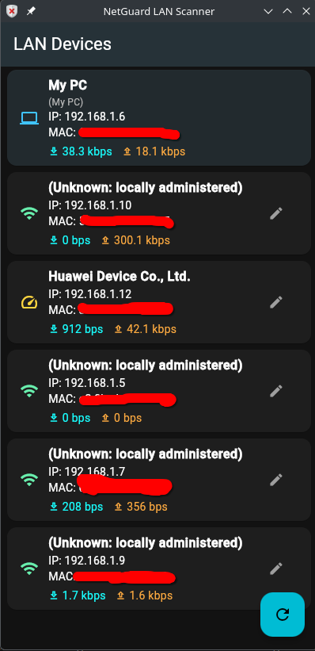

# 🛡️ NetGuard - LAN Network Monitor & Controller

**NetGuard** is a powerful, modern, and lightweight Linux application for monitoring and controlling local network traffic. Built with **Flutter** and **native Linux tools**, it provides real-time insights into network usage and gives you control over connected devices.


## 📸 Screenshots



## ✨ Features

- **🔍 Device Discovery**: Automatically scans and lists all devices connected to your LAN (IP, MAC Address, Vendor).
- **📊 Real-time Traffic Monitoring**: 
  - View live **Download** and **Upload** speeds for every device.
  - Monitor your own computer's traffic ("My PC") separately.
- **🚫 Access Control**: 
  - Cut internet access for specific devices using ARP Spoofing and IPTables.
  - Granular control over network flows.
- **🚀 Native Performance**: 
  - Built with Flutter for a beautiful UI.
  - Uses native C++ runner and Linux kernel tools (`iptables`, `tc`, `arpspoof`) for high performance.
- **📦 Portable**: Use the release version without installation.

## 🛠️ System Requirements

NetGuard relies on standard Linux networking tools. Ensure your system has the following installed:

- **OS**: Linux (Maintained distributions like Ubuntu, Debian, Fedora, Arch).
- **Permissions**: Root privileges (`sudo` or `pkexec`) are required for network monitoring and control.
- **Dependencies**:
  - **Debian/Ubuntu**:
    ```bash
    sudo apt install iptables dsniff iproute2 net-tools
    ```
  - **Arch Linux**:
    ```bash
    sudo pacman -S iptables dsniff iproute2 net-tools
    ```
  - **Fedora**:
    ```bash
    sudo dnf install iptables dsniff iproute net-tools
    ```
    *(Note: `dsniff` provides `arpspoof`, `iproute2` provides `ip` and `tc`)*

## 📥 Installation & Usage

### Option 1: Portable Release (Recommended)
1.  Download the **NetGuard_Release** folder.
2.  Run the setup script to install the desktop shortcut:
    ```bash
    ./NetGuard_Release/Setup_Shortcut.sh
    ```
3.  Launch **NetGuard** from your applications menu or desktop.

### Option 2: Build from Source
1.  **Clone the repository**:
    ```bash
    git clone https://github.com/Ibrahem3/netguard.git
    cd netguard
    ```
2.  **Install Flutter Dependencies**:
    ```bash
    flutter pub get
    ```
3.  **Build Release**:
    ```bash
    flutter build linux --release
    ```
4.  **Run**:
    ```bash
    ./run_with_root.sh
    ```

## ⚙️ Configuration

### Passwordless Execution
To run NetGuard without entering your password every time, the application can use a sudoers rule. The setup scripts included in the project can help configure this automatically by adding a rule to `/etc/sudoers.d/`.

## ⚠️ Disclaimer

**NetGuard is for educational and network administration purposes only.** 
Using network cutting features (ARP spoofing) on networks you do not own or have permission to manage is illegal and unethical. The developers assume no liability for misuse of this software.

## 🤝 Contributing

Contributions are welcome! Please fork the repository and submit a Pull Request.

---
*Developed with ❤️ by Ibrahem Samir <HemaVS>
